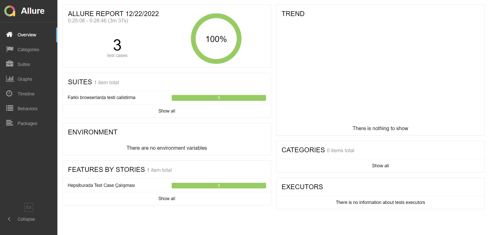
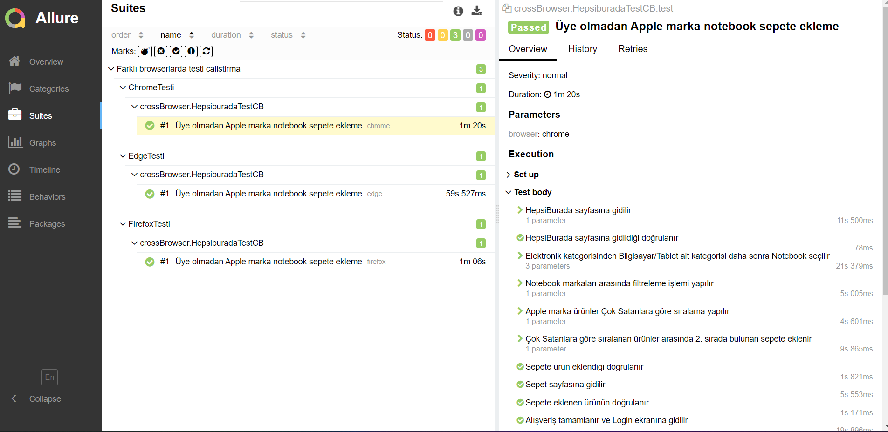
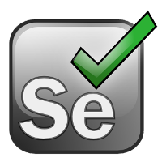

# Hepsiburada Test Case Çalışması 

# Senaryo:

- hepsiburada.com web sitesine gidilir, bu siteye gittiğini doğrulamanız gerekmektedir.
- Senaryoya üye kaydı oluşturmadan devam edilecek.
- Menüden Elektronik → Bilgisayar/Tablet → Notebook seçtirilir
- Çıkan listeleme ekranından Marka “Apple” seçtirlir.
- Daha sonra çıkan ekranda Sıralama ComboBoxından Çok Satanlara göre sıralama yaptırılır.
- Daha sonra çıkan ekrandaki 2. ürün Sepete eklenir. Bu işlemin ardından sepete eklenmiştir uyarı mesajının görülüp görülmediği doğrulanır.
- Sepete gidilip eklenen ürünün sepette olup olmadığı doğrulanır.
- Alışverişi tamamla butonuna basılır ve login ekranına yönlendirilip yönlendirmediği kontrol ettirilir.

# CrossBrowser test
- İlgili senaryoyu farklı browserlarda çaıştırmak için **CrossBrowser** ile Chrome, Firefox ve Edge de çalıştırılmıştır.

# Raporlama
Senaryoda raporlama olarak Allure Report kullanılmıştır. Senaryoları çalıştırdıktan sonra raporu görebilmek için
- 1- PowerShell açılır.
- 2- cd (dosya uzantısı) yazılıarak projenin dizinine gidilir.
- 3- Scoop u indirmek için ilk kodumuz. Set-ExecutionPolicy RemoteSigned -scope CurrentUser komutu yazılır.
- 4- Daha sonra Scoop u indiriyoruz. iex (new-object net.webclient).downloadstring('https://get.scoop.sh') komutu yazılır.
- 5- Kodu çalıştırdıktan sonra allure serve allure-results komutu yazılır ve rapor sayfası açılır.

- Raporun ekran görüntüsü

  
  -
  
  -

# Test
- Framework Java Programlama dilinde **Page Object Model(POM)** ile dizayn edilmiştir.
- Selenium ve TestNG kullanılarak Web otomasyonu yapılmıştır.
- Framework içerisinde **Object Oriented Programming(OOP)** kullanılmıştır.
- Rapoprlama olarak **Allure Report** kullanılmıştır.
- İstenilen aşamalarda Assertion'lar kullanılarak doğrulamalar yapılmıştır.

  
  
  
  
